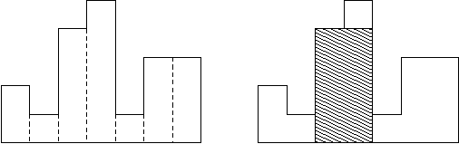

[toc]

## 栈

### 引入

#### 洗碗问题

小泽是餐厅里的洗碗工。

每天都有堆积如山的盘子需要他洗。他每次从这叠盘子里面取出最顶上的那一个，然后把它洗干净，放到别的地方。

恰饭的人源源不断，所以需要洗的盘子也源源不断地送过来。每次来了新的盘子，都会被放在那叠盘子的最顶上。

**如何用一个数组模拟这叠盘子？**


| 事件          | 状态    |
| ------------- | ------- |
| 放入 1        | 1       |
| 放入 2        | 1, 2    |
| 放入 3        | 1, 2, 3 |
| 取出顶端（3） | 1, 2    |
| 取出顶端（2） | 1       |
| 放入 4        | 1, 4    |
| 放入 5        | 1, 4, 5 |
| 取出顶端（5） | 1, 4    |
| 取出顶端（4） | 1       |
| 取出顶端（1） | 空      |

### 栈的性质

在前面的引用中，我们发现：盘子都是从顶端进，从顶端出。如果 $a$ 比 $b$ 早进入，那么 $a$ 一定比 $b$ 后退出。

这个性质即为"后进先出"，它是 **栈** 的本质。

**栈**（stack）：LIFO（Last In, First out）表

### 栈的实现

#### C-style 模拟

```cpp
int stk[N], top = 0;
// 向栈顶插入一个数
stk[++top] = x;
// 从栈顶弹出一个数
top--;
// 获取栈顶的值
stk[top];
// 判断栈是否为空
if (top > 0) { }
```

#### STL 实现

STL 中可以使用 `std::vector` 来模拟栈操作，主要函数包括：

1. 元素访问
   1. `stk.back()` 返回栈顶元素
2. 修改
   1. `stk.push_back()` 在栈顶插入元素
   2. `stk.pop_back()` 弹出栈顶元素
3. 容量
   1. `stk.empty()` 栈是否为空
   2. `stk.size()` 返回栈中元素的数量

```cpp
std::vector<int> stk;
// 向栈顶插入一个数
stk.push_back(x);
// 从栈顶弹出一个数
stk.pop_back();
// 获取栈顶的值
stk.back();
// 判断栈是否为空
if (!stk.empty()) { }
```

### 例题

#### 例题一 栈的实现

请你实现一个栈（stack），支持以下操作：

1. `push(x)`: 向栈中加入一个数 x。
2. `pop()`: 将栈顶输出。如果此时栈为空则不进行弹出操作，输出 `Empty`。
3. `query()`: 输出栈顶元素，如果此时栈为空则输出 `Anguei!`。
4. `size()`: 输出此时栈内元素个数。


##### 代码

此处使用 `std::vector` 进行栈的模拟。

以下仅展示核心逻辑部分的代码。

```cpp
if (op == "push") {
    u64 x;
    std::cin >> x;
    stk.push_back(x);
} else if (op == "pop") {
    if (stk.empty()) {
        std::cout << "Empty\n";
    } else {
        stk.pop_back();
    }
} else if (op == "query") {
    if (stk.empty()) {
        std::cout << "Anguei!\n";
    } else {
        std::cout << stk.back() << "\n";
    }
} else {
    std::cout << stk.size() << "\n";
}
```

#### 例题二 括号匹配问题

给定一串由 () 和 [] 组成的字符串，我们规定以下的字符串是合法的字符串：

1. 空串是合法的
2. 如果 A、B 都是合法的，那么 AB 是合法的
3. 如果 A 是合法的，那么 (A) 和 [A] 都是合法的

请写出一个程序，判断每一个给定的字符串是否合法。

##### 分析

我们可以先手玩一下以下的字符串是否合法：

- `[(())]`
- `()[]()`
- `[([])[]]()`
- `(()`
- `([)(])`

将一个字符串从左往右写，一旦遇到匹配上的括号，就把这对括号擦掉。

我们可以使用一个栈来维护上面的操作。

当新加入一个括号时：

1. 如果是左括号，则把这个括号入栈
2. 如果是右括号，看栈顶是否能和这个右括号匹配，如果可以的话弹出栈顶，否则这个字符串不合法

##### 代码

完整代码见  [vjudge 提交记录](https://vjudge.net/solution/64150195/NWv7brPjI5uhjS91FLfu)

```cpp
for (int i = 0; i < s.length(); i++) {
    if (s[i] == '(' or s[i] == '[') {
        stk.push_back(s[i]);
    } else {
        if (not stk.empty() and s[i] == ')' and stk.back() == '(') {
            stk.pop_back();
        } else if (not stk.empty() and s[i] == ']' and stk.back() == '[') {
            stk.pop_back();
        } else {
            std::cout << "No\n";
            return;
        }
    }
}
if (not stk.empty()) {
    std::cout << "No\n";
} else {
    std::cout << "Yes\n";
}
```

#### 例题三 后缀表达式

所谓后缀表达式是指这样的一个表达式：式中不再引用括号，运算符号放在两个运算对象之后，所有计算按运算符号出现的顺序，严格地由左而右新进行（不用考虑运算符的优先级）。

本题中运算符仅包含 $+ - * /$。保证对于 $/$ 运算除数不为 $0$。特别地，其中 $/$ 运算的结果需要向 $0$ 取整（即与 C++ $/$ 运算的规则一致）。

如：$3*(5-2)+7$ 对应的后缀表达式为：$3.5.2.-*7.+@$。在该式中，$@$ 为表达式的结束符号。$.$ 为操作数的结束符号。

##### 分析

后缀表达式不需要使用括号，其运算方案是唯一的。对于计算机来说，最容易理解后缀表达式。

<div style="border: 1px solid black; padding: 1em; margin: 1em 0;"><div style="text-align: center; font-weight: bold; margin-bottom: 1em;">后缀表达式求值</div><ol><li>建立一个用于存数的栈，逐一扫描该后缀表达式中的元素。</br></br><ol><li>如果遇到一个数，则把该数入栈</br></br></li><li>如果遇到运算符，就取出栈顶的两个数进行计算，把结果入栈</br></br></li></ol></li><li>扫描完成后，栈中恰好剩下一个数，就是该后缀表达式的值</li></ol></div>


#####  代码

由于该题的逆天输入格式，这里使用 Java 代码演示主要逻辑：

```java
Pattern p = Pattern.compile("(\\d+|[+\\-*\\/])");
Matcher m = p.matcher(s);

Stack<Integer> stk = new Stack<>();
while (m.find()) {
    String x = m.group(1);
    if (x.matches("\\d+")) {
        stk.push(Integer.parseInt(x));
    } else {
        int b = stk.peek();
        stk.pop();
        int a = stk.peek();
        stk.pop();
        stk.push(
            switch (x) {
                case "+" -> a + b;
                case "-" -> a - b;
                case "*" -> a * b;
                case "/" -> a / b;
                default -> 0;
            }
        );
    }
}
System.out.println(stk.peek());
```


### 课后作业

- 最小栈 [LeetCode 155](https://leetcode.cn/problems/min-stack/) （栈的灵活应用）
- Editor [HDU 4699](https://acm.hdu.edu.cn/showproblem.php?pid=4699)（对顶栈）
- [NOIP 2013 普及组] 表达式求值 [Luogu P1981](https://www.luogu.com.cn/problem/P1981) （中缀表达式求值）
- [河南省第十五届ICPC大学生程序设计竞赛] 表达式求导 （中缀表达式递归求值）
- [NOIP 2003 普及组] 栈 [Luogu P1044](https://www.luogu.com.cn/problem/P1044) （栈的数学性质）


### 进阶：单调栈

顾名思义，单调栈即满足单调性的栈结构。

常用于找出每个数左边离它最近的比它大/小的数，也可用于求出“以某个只为最值的最大区间”。

是较为常用的优化技巧，借助单调性处理问题，**及时排除不可能的选项，保持策略集合的高度有序性和秩序性**。


#### 例题

##### 例题一 单调栈

给出项数为 $n$ 的整数数列 $a_{1 \dots n}$。

定义函数 $f(i)$ 代表数列中第 $i$ 个元素之后第一个大于 $a_i$ 的元素的**下标**，即 $f(i)=\min_{i<j\leq n, a_j > a_i} \{j\}$。若不存在，则 $f(i)=0$。

试求出 $f(1\dots n)$。

###### 代码

```cpp
std::vector<int> ans(n);
std::vector<int> stk;
for (int i = n - 1; i >= 0; i--) {
    while (not stk.empty() and a[stk.back()] <= a[i]) {
        stk.pop_back();
    }
    if (stk.empty()) {
        ans[i] = -1;
    } else {
        ans[i] = stk.back();
    }
    stk.push_back(i);
}

for (int i = 0; i < n; i++) {
    std::cout << ans[i] + 1 << " \n"[i == n - 1];
}
```


##### 例题二 Largest Rectangle in a Histogram

如下图所示，在一条水平线上方有若干个矩形，求包含与这些矩形的并集内部的最大矩形的面积。（在下图中，答案就是阴影部分的面积），矩形个数 $\le 10^5$。



###### 分析

我们考虑简化的问题：如果矩形的高度从左到右单调递加，那么答案怎么计算？显然局部最优解是每个矩形的高度作为最终矩形的高度，宽度延伸到右边界，在所有这样的矩形中取最大值就是答案。

如果下一个矩形的高度比上一个小，那么之前高出来的部分就不能利用了，我们可以把这些矩形删掉，用一个合并过的新矩形代替，不会影响后面的计算。

于是我们维护的轮廓就变成了一个高度始终单调递增的矩形序列，我们可以添加一个高度为 $0$ 的虚拟矩形，避免扫描结束后栈中有剩余矩形。

###### 代码

```cpp
std::vector<int> h(n + 1), w(n + 1);
for (int i = 0; i < n; i++) {
    std::cin >> h[i];
}

i64 ans = 0;
std::vector<int> stk;
for (int i = 0; i <= n; i++) {
    while (!stk.empty() && h[stk.back()] > h[i]) {
        w[i] += w[stk.back()];
        ans = std::max(ans, 1LL * w[i] * h[stk.back()]);
        stk.pop_back();
    }
    w[i]++;
    stk.push_back(i);
}
std::cout << ans << "\n";
```

<div style="page-break-after: always;"></div>

## 队列

### 引入

#### 排队问题

这回小泽作为一个收银员在超市打工。收银员会给排在队伍最前面的顾客结账，然后服务队伍中的下一个顾客。而队伍的末尾也一直会有更多的顾客依次加人队列。

如何用一个数组模拟这个队伍？


| 事件              | 队伍的状态 |
| ----------------- | ---------- |
| 顾客1加入队列     | 1          |
| 顾客2加入队列     | 1 2        |
| 顾客3加入队列     | 1 2 3      |
| 收银员帮顾客1买单 | 2 3        |
| 收银员帮顾客2买单 | 3          |
| 顾客4加入队列     | 2 4        |
| 顾客5加入队列     | 3 4 5      |
| 收银员帮顾客3买单 | 4 5        |
| 收银员帮顾客4买单 | 5          |
| 收银员帮顾客5买单 | 空         |

### 队列的性质

<font color="red">队列</font>的本质是“先进先出”：越先来的，越早办完事。

**队列**（queue）：FIFO（First In, First Out）表。


### 队列的实现

#### C-style 模拟

```cpp
int q[N], head = 0, tail = -1;
// 向队列中加入一个数
q[++tail] = x;
// 从队头弹出一个数
head++;
// 获取队头的值
q[head];
// 判断队列是否为空
if (head <= tail) { }
```


#### 循环队列

我们发现，当弹出较多元素时，数组中队头之前的空间就浪费了，**循环队列** 是一种充分利用数组空间的方法。

```cpp
int q[N], head = 0, tail = 0;
// 向队列中加入一个数
q[tail++] = x;
if (tail == N) {
    tail = 0;
}
// 从队头弹出一个数
head++;
if (head == N) {
    head = 0;
}
// 获取队头的值
q[head];
// 判断队列是否为空
if (head != tail) { }
```


#### STL 实现

STL 中的 `std::queue` 容器提供了一众成员函数一共调用，其中常用操作有：

1. 元素访问
   1. `q.front()` 返回队首元素
   2. `q.back()` 返回队尾元素
2. 修改
   1. `q.push()` 在队尾插入元素
   2. `q.pop()` 弹出队首元素
3. 容量
   1. `q.empty()` 队列是否为空
   2. `q.size()` 返回队列中元素的数量

双端队列 `std::deque` 的操作相似。


### 例题

#### 例题一 约瑟夫问题

$n$ 个人围成一圈，从第一个人开始报数,数到 $m$ 的人出列，再由下一个人重新从 $1$ 开始报数，数到 $m$ 的人再出圈，依次类推，直到所有的人都出圈，请输出依次出圈人的编号。

##### 代码

由于每个小朋友都有机会数 $m$ 次，所以时间复杂度是 $O(nm)$。

```cpp
std::queue<int> q;
for (int i = 1; i <= n; i++) {
    q.push(i);
}

int cur = 1;
while (not q.empty()) {
    int x = q.front();
    q.pop();

    if (cur != m) {
        q.push(x);
        cur++;
    } else {
        std::cout << x << " ";
        cur = 1;
    }
}
```


### 课后作业

- [NOIP 2010 提高组] 机器翻译 [Luogu P1540](https://www.luogu.com.cn/problem/P1540) （队列的应用）


### 进阶：单调队列

单调队列的思想和单调栈相同，**在决策集合中及时排除一定不是最优解的选择**。

在 OI 圈中有一句生动形象的话来形容其原理：“*如果一个选手比你小还比你强，那你就可以退役了*”，这启发我们用贡献的角度考虑其原理：更老而更弱的选手贡献更小。

单调队列是一种优化动态规划的重要手段。


#### 例题一 扫描

有一个 $1 \times n$ 的矩阵，有 $n$ 个整数。

现在给你一个可以盖住连续 $k$ 个数的木板。

一开始木板盖住了矩阵的第 $1 \sim k$ 个数，每次将木板向右移动一个单位，直到右端与第 $n$ 个数重合。

每次移动前输出被覆盖住的数字中最大的数是多少。

##### 分析

这是一道**滑动窗口**的裸题，我们先手玩一下样例：

```
5 3
1 5 3 4 2
```

过程如下：
$$
\begin{aligned}
	& \underline{1 \ \boxed5 \ 3} \ 4 \ 2 \\
	& 1 \ \underline{\boxed5 \ 3 \ 4} \ 2 \\
	& 1 \ 5 \ \underline{3 \ \boxed4 \ 2} \\
	
\end{aligned}
$$
如果用最暴力的 $O(n k)$ 做法，显然进行了大量的重复工作：一个更靠前但更小的数显然对答案没有贡献（~~更老但是更蒻的选手可以退役了~~）。

我们可以维护一个长度有限的队列，其内部**索引递增，数值递减**，队头即为当前的最大值。

当队头的索引超出范围时，弹出队头，维护区间的长度。

当新加一个数的时候，我们把队尾所有小于当前数的元素删掉，从而维护单调性。

由于每一个数最多**入队一次，出队一次**，所以算法的时间复杂度是 $O(n)$。

##### 代码

```cpp
std::vector<int> ans(n);
std::deque<int> q;
for (int i = 0; i < n; i++) {
    if (not q.empty() and q.front() < i - k + 1) {
        q.pop_front();
    }
    while (not q.empty() and a[q.back()] < a[i]) {
        q.pop_back();
    }
    q.push_back(i);
    ans[i] = a[q.front()];
}
for (int i = k - 1; i < n; i++) {
    std::cout << ans[i] << "\n";
}
```


#### 例题二 最大子序和

输入一个长度为 $n$ 的整数序列（可能有负数），从中找出一段长度不超过 $m$ 的连续子序列，使得子序列中所有数的和最大。

##### 分析

我们知道，区间和问题可以使用前缀和求解：连续子序列 $[l, r]$ 中的数的和等于 $s[r] - s[l - 1]$。于是问题可以转化为：找出两个位置 $x, y$，使得 $s[y] - s[x]$ 最大，其中 $y - x \le m$。

对于一个固定的 $y$，问题转化为：找到一个左端点 $x \in [y - m, y - 1]$，使得 $s[x]$ 最小。

通过上面的分析，我们将该题转化为在一个长度固定的区间内找最小值的问题，即上面的**滑动窗口**问题。

##### 代码

```cpp
i64 ans = -inf;
std::deque<int> q;
for (int i = 0; i <= n; i++) {
    if (not q.empty() and q.front() < i - m) {
        q.pop_front();
    }
    if (not q.empty()) {
        ans = std::max(ans, pre[i] - pre[q.front()]);
    }
    while (not q.empty() and pre[q.back()] > pre[i]) {
        q.pop_back();
    }
    q.push_back(i);
}
std::cout << ans << "\n";
```


## 链表

### 链表的性质

数组是一种支持随机访问，但不支持在任意位置插入或删除元素的数据结构。与之对应，链表支持在任意位置插入或删除，但只能按顺序依次访问其中的元素。

<font color="red">链表</font> 的本质是相邻元素相连接。


### 链表的实现

通常使用 C-style 数组模拟实现链表：

```cpp
// e[]表示节点的值，l[]表示节点的左指针，r[]表示节点的右指针，idx表示当前用到了哪个节点
int e[N], l[N], r[N], idx;
// 初始化
void init()
{
    //0是左端点，1是右端点
    r[0] = 1, l[1] = 0;
    idx = 2;
}
// 在节点a的右边插入一个数x
void insert(int a, int x)
{
    e[idx] = x;
    l[idx] = a, r[idx] = r[a];
    l[r[a]] = idx, r[a] = idx ++ ;
}
// 删除节点a
void remove(int a)
{
    l[r[a]] = l[a];
    r[l[a]] = r[a];
}
```


### 例题

#### 例题一 约瑟夫问题

跟前面的问题相同，你能使用链表实现吗？


#### 例题二 链式前向星

读入 $n$ 个点，$m$ 条边，保存这个图。

##### 分析

**邻接表**是链表的其中一个重要应用，它是树与图结构的一般化存储方式。

具体来说，链式前向星实现的邻接表，是用一个数组存每一个点的出边组成的链表的“表头”。

链式前向星中一般而言使用 $h, e, ne, w$ 四个数组来存图，$h$ 和 $ne$ 数组存的是 “$e$ 数组的下标”，相当于指针。$e$ 数组存储的是每条边的终点，$w$ 数组存储的是每条边的权值，是图的真实数据。

我们使用 $h$ 获取“表头”，$ne$ 获取当前边在出边组成的链表中的后继，进而可以遍历某个点的每一个出边。


##### 代码

```cpp
// 对于每个点k，开一个单链表，存储k所有可以走到的点。h[k]存储这个单链表的头结点
int h[N], e[N], ne[N], idx;
// 添加一条边a->b
void add(int a, int b)
{
    e[idx] = b, ne[idx] = h[a], h[a] = idx ++ ;
}
// 初始化
idx = 0;
memset(h, -1, sizeof h);
// 遍历某个节点的所有出边
for (int i = h[u]; i != -1; i = ne[i]) { }
```


## 并查集 & Hash 表……（未完待续）
